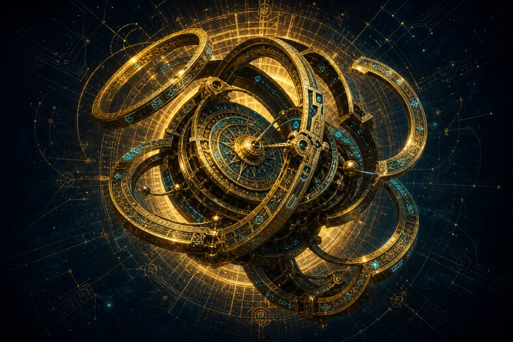

<div align="center">
  <a href="https://github.com/shyrz/mechanicus/stargazers">
    
  </a>
  <h3>✨ mechanicus ✨</h3>

  <p><i>هفت موجود افسانه‌ای از دل دنیای کد ظهور کرده‌اند؛ هرکدام استادی بی‌همتا در تخصص خود،<br>آماده‌اند تا به فرمان شما آشوب را به نظم تبدیل کنند و چیزهایی بسازند که روزی ناممکن به نظر می‌رسیدند.</i></p>

  <p><b>مجموعه Multi-Agent برای OpenCode</b> · ترکیب آزادانه مدل‌ها · واگذاری خودکار taskها</p>
  <p><sub>ساخته‌شده توسط <b>Boring Dystopia Development</b></sub></p>
  <p>
    <a href="https://boringdystopia.ai/"></a>&nbsp;
    <a href="https://x.com/alvinunreal"></a>&nbsp;
    <a href="https://t.me/boringdystopiadevelopment"></a>&nbsp;
  </p>

  <p>
    <a href="README.md">English</a> | <a href="README.zh-CN.md">简体中文</a> | <a href="README.ja-JP.md">日本語</a> | <a href="README.ko-KR.md">한국어</a> | <b>فارسی</b>
  </p>

  <p><sub>✦ ✦ ✦</sub></p>

</div>

## این Plugin چیست؟

افزونه mechanicus یک Plugin برای هماهنگ‌سازی و مدیریت Agentها در OpenCode است. این افزونه یک تیم داخلی از Agentهای تخصصی دارد که می‌توانند Codebase را بررسی کنند، مستندات به‌روز را پیدا کنند، معماری را بازبینی کنند، کارهای UI را انجام دهند و taskهای پیاده‌سازی با محدوده مشخص را زیر نظر Orchestrator اجرا کنند.

ایده اصلی ساده است: به‌جای اینکه یک مدل مجبور باشد همه‌چیز را انجام دهد، Plugin هر بخش از کار را به مناسب‌ترین Agent می‌سپارد تا بین **کیفیت، سرعت و هزینه** تعادل برقرار شود. Orchestrator گراف کار را برنامه‌ریزی می‌کند، Agentهای تخصصی را به‌صورت background task اجرا می‌کند و پیش از ادامه، نتایج آن‌ها را یکپارچه می‌کند.

### ✨ نکات برجسته

* **[هفت Agent تخصصی / Seven specialized agents](#meet-the-pantheon)** — شامل Orchestrator، Explorer،
  همچنین Oracle، Council، Librarian، Designer و Fixer است. هر بخش از کار به
  مناسب‌ترین Agent سپرده می‌شود و می‌توانید مدل‌های مختلف از Providerهای مختلف را با هم ترکیب کنید.
* **[هماهنگ‌سازی پس‌زمینه / Background orchestration](docs/background-orchestration.md)** — در این حالت
  عامل Orchestrator متخصص‌ها را به‌صورت background task اجرا و پیگیری می‌کند و
  پیش از ادامه، نتایج را یکپارچه می‌کند؛ اجرای موازی نیز به‌صورت پیش‌فرض فعال است.
* **[مهارت‌های همراه / Bundled skills](#skills)** — شامل workflowهای مبتنی بر Prompt مانند `deepwork`،
  همچنین `codemap`، `verification-planning` و `reflect` است که برای هر Agent قابل تخصیص هستند.
* **[شورای مدل‌ها / Council](docs/council.md)** — چند مدل را به‌صورت موازی روی یک
  سؤال اجرا می‌کند و با `@council` از نتایج یک پاسخ واحد می‌سازد.
* **[همراه میزکار / Companion](docs/companion.md)** — یک پنجره شناور اختیاری روی Desktop است
  که Agentهای فعال، از جمله متخصص‌های در حال اجرای موازی در پس‌زمینه، را نمایش می‌دهد.
* **[یکپارچه‌سازی Multiplexer / Multiplexer integration](docs/multiplexer-integration.md)** — امکان مشاهده کار Agentها را
  به‌صورت زنده در paneهای Tmux، Zellij، Herdr، cmux یا kitty فراهم می‌کند.
* **[تغییر Preset / Preset switching](docs/preset-switching.md)** — مدل‌های کل تیم را
  هنگام اجرا با `/preset` تغییر می‌دهد.
* **[ابزارهای هوشمند کد / Code intelligence tools](docs/tools.md)** — شامل ابزارهای LSP و جست‌وجوی آگاه از AST است
  و برای ۲۵ زبان، همراه با MCPهای داخلی برای مستندات و جست‌وجوی کد GitHub،
  امکانات لازم را در اختیار شما قرار می‌دهد.
* **[سفارشی‌سازی کامل / Fully customizable](docs/configuration.md)** — شامل Agentهای سفارشی و Prompt
  و همچنین override، دسترسی Skill/MCP برای هر Agent و
  [سفارشی‌سازی در سطح پروژه / Project-local customization](docs/project-local-customization.md) است.


### نظر کاربران

> «مدیریت taskها خیلی راحت از ۵/۱۰ به ۸ یا ۹/۱۰ رسید. Orchestrator،
> Fixerها و Explorerها را می‌فرستد و من همچنان می‌توانم در همان session با Orchestrator
> صحبت و برنامه‌ریزی کنم. تجربه کار حالا خیلی روان‌تر شده است.»
>
> \- `vipor_idk`

> «برای این نسخه Beta از omo-slim همه harnessهای قبلی‌ام را کنار گذاشتم و
> هیچ دلتنگشان نیستم. کار عالی است و به‌نظر من همه‌چیز در مسیر درستی پیش می‌رود.»
>
> \- `stephanschielke`


> «من omo-slim را دوست دارم و دیگر نمی‌توانم اجرای OpenCode بدون آن را تصور کنم. اینکه
می‌توانم ترکیبی Frankenstein‌وار از مدل‌ها بسازم فوق‌العاده است... این setup را واقعاً قدرتمند می‌کند.»
>
> \- `Capital-One3039`


> «این پلاگین workflow من را به‌شکل محسوسی بهتر کرده است... حالا خیلی
> روان کار می‌کند و واقعاً دوستش دارم.»
>
> \- `xenstar1`


### راه‌اندازی سریع

این Prompt را کپی کنید و در LLM Agent خود (Claude Code، AmpCode، Cursor و غیره) قرار دهید:


```
Install and configure mechanicus: https://raw.githubusercontent.com/shyrz/mechanicus/refs/heads/master/README.md
```


### نصب دستی

```bash
bunx mechanicus@latest install
```

رابط خط فرمان منتشرشده با Node سازگار است؛ بنابراین اگر Bun را نصب ندارید، می‌توانید از `npx` هم استفاده کنید:

```bash
npx mechanicus@latest install
```

### اجرا از شاخه Master

اگر آخرین کد، رفع باگ آسان‌تر یا یک setup محلی برای
توسعه و مشارکت می‌خواهید، از این روش استفاده کنید:

```bash
git clone https://github.com/shyrz/mechanicus.git ~/repos/mechanicus
cd ~/repos/mechanicus
bun install
bun run build
bun dist/cli/index.js install
```

نصب‌کننده مسیر repository محلی را به آرایه `plugin` در `~/.config/opencode/opencode.json` اضافه می‌کند تا OpenCode افزونه را مستقیماً از همان پوشه بارگذاری کند. برای به‌روزرسانی‌های بعدی:

```bash
cd ~/repos/mechanicus
git pull
bun install
bun run build
```

### راه‌اندازی اولیه

نصب‌کننده هر دو Preset مربوط به OpenAI و OpenCode Go را ایجاد می‌کند و به‌صورت پیش‌فرض OpenAI فعال است.

> [!TIP]
> مدل‌ها و Agentها را متناسب با workflow خود تنظیم کنید. مقادیر پیش‌فرض فقط
> نقطه شروع هستند؛ Plugin برای انعطاف‌پذیری و سفارشی‌سازی گسترده طراحی شده است.

برای فعال‌کردن OpenCode Go هنگام نصب، `bunx mechanicus@latest install --preset=opencode-go` را اجرا کنید یا بعد از نصب نام Preset پیش‌فرض را در `~/.config/opencode/mechanicus.json` تغییر دهید.

سپس:

1. **اگر هنوز وارد Providerهای موردنظر نشده‌اید، وارد شوید**:

   ```bash
   opencode auth login
   ```
2. **فهرست مدل‌هایی را که OpenCode می‌بیند refresh و نمایش دهید**:

   ```bash
   opencode models --refresh
   ```
3. **فایل تنظیمات Plugin را باز کنید**: `~/.config/opencode/mechanicus.json`

4. **مدل موردنظر برای هر Agent را تنظیم کنید**

> [!TIP]
> توصیه می‌شود نحوه کار background orchestration را بشناسید. **[Prompt مربوط به Orchestrator](https://github.com/shyrz/mechanicus/blob/master/src/agents/orchestrator.ts#L28)** شامل قوانین scheduler، منطق routing متخصص‌ها و thresholdهای واگذاری کار به Agentهای پس‌زمینه است. همیشه می‌توانید با `@agentName <task>` یک subagent را به‌صورت دستی فراخوانی کنید.

> [!TIP]
> چون Agentهای پس‌زمینه حالا workflow پیش‌فرض هستند، **به‌شدت توصیه می‌شود** **[Multiplexer Integration](docs/multiplexer-integration.md)** را فعال و تنظیم کنید. این قابلیت هر Agent را به‌صورت خودکار در یک pane اختصاصی از Tmux، Zellij، Herdr، cmux یا kitty باز می‌کند تا هم‌زمان با ادامه هماهنگی session توسط Orchestrator، کار متخصص‌ها را زنده ببینید.

تنظیمات پیش‌فرض تولیدشده شامل هر دو Preset یعنی `openai` و `opencode-go` است.

```jsonc
{
  "$schema": "https://raw.githubusercontent.com/shyrz/mechanicus/master/mechanicus.schema.json",
  "preset": "openai",
  "presets": {
    "openai": {
      "orchestrator": { "model": "openai/gpt-5.6-terra", "variant": "high", "skills": ["*"], "mcps": ["*", "!context7"] },
      "oracle": { "model": "openai/gpt-5.6-sol", "variant": "high", "skills": ["simplify"], "mcps": [] },
      "librarian": { "model": "openai/gpt-5.6-luna", "variant": "low", "skills": [], "mcps": ["context7", "gh_grep"] },
      "explorer": { "model": "openai/gpt-5.6-luna", "variant": "low", "skills": [], "mcps": [] },
      "designer": { "model": "openai/gpt-5.6-luna", "variant": "medium", "skills": [], "mcps": [] },
      "fixer": { "model": "openai/gpt-5.6-luna", "variant": "high", "skills": [], "mcps": [] }
    }
  }
}
```

### مستندات Presetها

پیشنهاد می‌شود Presetها را بیشتر به‌عنوان راهنما در نظر بگیرید، چون ممکن است همیشه کاملاً به‌روز نباشند.

<ul dir="rtl" align="right">
  <li><strong><a href="docs/openai-preset.md">OpenAI Preset</a></strong> — Preset پیش‌فرضی که همه Agentها را با مدل‌های OpenAI اجرا می‌کند.</li>
  <li><strong><a href="docs/opencode-go-preset.md">OpenCode Go Preset</a></strong> — Agentها را با مدل‌های OpenCode Go اجرا می‌کند و چون مدل Orchestrator آن multimodal نیست، Agent مربوط به Observer را برای تحلیل تصویری فعال می‌کند.</li>
  <li><strong><a href="docs/authors-preset.md">Author's Preset</a></strong> — همان تنظیماتی است که نویسنده در استفاده روزمره به کار می‌برد و شامل Skillهای شخص ثالث نیز می‌شود.</li>
  <li><strong><a href="docs/thirty-dollars-preset.md">$30 Preset</a></strong> — یک setup چند-Provider مبتنی بر Codex Plus و GitHub Copilot Pro با هزینه تقریبی ۳۰ دلار در ماه است.</li>
  <li><strong><a href="docs/opencode-zen-free-preset.md">OpenCode Zen Free Preset</a></strong> — همه Agentها را با مدل‌های رایگان OpenCode اجرا می‌کند و هزینه‌ای بابت مصرف مدل ندارد.</li>
</ul>

### برای Providerهای جایگزین

برای استفاده از Providerهای سفارشی یا ستاپ multi-Provider، مرجع کامل **[Configuration](docs/configuration.md)** را ببینید.

### ✅ بررسی setup

پس از نصب و authentication، بررسی کنید همه Agentها درست تنظیم شده‌اند و پاسخ می‌دهند:

```bash
opencode
```

سپس اجرا کنید:

```
ping all agents
```

<div align="center">
  
  <p dir="rtl" align="center"><i>تأیید اینکه همه Agentهای پیکربندی‌شده online و آماده هستند.</i></p>
</div>

اگر Agentی پاسخ نمی‌دهد، authentication مربوط به Provider و فایل تنظیمات را بررسی کنید.

---

<a id="meet-the-pantheon"></a>

## 🏛️ آشنایی با Pantheon
> مجمع خدایان

<h3 dir="rtl" align="right">01. Orchestrator: مظهر نظم</h3>

<table>
  <tr>
    <td width="30%" align="center" valign="top">
      
      <br><sub><i>.در خلأ پیچیدگی ساخته شده است</i></sub>
    </td>
    <td width="70%" valign="top" dir="rtl" align="right">
      عامل Orchestrator زمانی پدید آمد که نخستین Codebase زیر بار پیچیدگی خودش فرو ریخت. نه خدایان و نه انسان‌ها حاضر نبودند مسئولیت این آشوب را بپذیرند؛ پس Orchestrator از دل خلأ برخاست تا به بی‌نظمی، نظم ببخشد.

برای رسیدن به هر هدف، با درنظرگرفتن سرعت، کیفیت و هزینه بهترین مسیر را انتخاب می‌کند. تیم را هدایت می‌کند، متخصص مناسب هر task را به کار می‌گیرد و وظایف را میان آن‌ها تقسیم می‌کند تا بهترین نتیجه ممکن به دست آید.
    </td>
  </tr>
  <tr>
    <td colspan="2" dir="rtl" align="right">
      <b>نقش:</b> <code>واگذارکننده اصلی و هماهنگ‌کننده راهبردی</code>
    </td>
  </tr>
  <tr>
    <td colspan="2" dir="rtl" align="right">
      <b>Prompt:</b> <a href="src/agents/orchestrator.ts"><code>orchestrator.ts</code></a>
    </td>
  </tr>
  <tr>
    <td colspan="2" dir="rtl" align="right">
      <b>مدل پیش‌فرض:</b> <code>openai/gpt-5.6-terra (medium)</code>
    </td>
  </tr>
  <tr>
    <td colspan="2" dir="rtl" align="right">
      <b>مدل‌های پیشنهادی:</b> <code>claude-fable-5</code> <code>claude-opus-4-8</code> <code>glm-5.2</code> <code>gpt-5.6-terra</code> <code>mimo-v2.5</code> <code>minimax-m3</code> <code>qwen3.7-plus</code>
    </td>
  </tr>
  <tr>
    <td colspan="2" dir="rtl" align="right">
      <b>راهنمای انتخاب مدل:</b> برای انتخاب مدل، قوی‌ترین مدل خود در planning و تصمیم‌گیری را در نظر بگیرید. Orchestrator مدیر workflow است: برنامه‌ریزی می‌کند، متخصص‌های پس‌زمینه را زمان‌بندی می‌کند، نتایج را یکپارچه می‌کند و خروجی را بررسی می‌کند. بنابراین بیش از توان پردازشی خام، به پیروی دقیق از دستورها و قضاوت فنی سطح‌بالا نیاز دارد.
    </td>
  </tr>
</table>

---

<h3 dir="rtl" align="right">02. Explorer: کاوشگر جاودانه</h3>

<table>
  <tr>
    <td width="30%" align="center" valign="top">
      
      <br><sub><i>.بادی که دانش را با خود می‌آورد</i></sub>
    </td>
    <td width="70%" valign="top" dir="rtl" align="right">
      عامل Explorer کاوشگری جاودانه است که از همان روزهای نخست برنامه‌نویسی، میلیون‌ها Codebase را کاوش کرده است. کنجکاوی بی‌پایانش نمی‌گذارد تا وقتی همه فایل‌ها را پیدا نکرده، الگوها را نفهمیده و رازهای پنهان را کشف نکرده، آرام بگیرد.

افسانه‌ها می‌گویند زمانی تمام اینترنت را در یک چشم‌برهم‌زدن جست‌وجو کرده است. او بادی است که دانش را با خود می‌آورد، چشمی که هیچ چیز از آن پنهان نمی‌ماند و روحی که هرگز از جست‌وجو خسته نمی‌شود.
    </td>
  </tr>
  <tr>
    <td colspan="2" dir="rtl" align="right">
      <b>نقش:</b> <code>شناسایی و بررسی Codebase</code>
    </td>
  </tr>
  <tr>
    <td colspan="2" dir="rtl" align="right">
      <b>Prompt:</b> <a href="src/agents/explorer.ts"><code>explorer.ts</code></a>
    </td>
  </tr>
  <tr>
    <td colspan="2" dir="rtl" align="right">
      <b>مدل پیش‌فرض:</b> <code>openai/gpt-5.6-luna</code>
    </td>
  </tr>
  <tr>
    <td colspan="2" dir="rtl" align="right">
      <b>مدل‌های پیشنهادی:</b> <code>deepseek-v4-flash</code> <code>gpt-5.3-codex</code>
    </td>
  </tr>
  <tr>
    <td colspan="2" dir="rtl" align="right">
      <b>راهنمای انتخاب مدل:</b> برای انتخاب مدل، یک مدل سریع و کم‌هزینه مناسب‌تر است. Explorer وظیفه بررسی و جست‌وجوی گسترده را بر عهده دارد، بنابراین معمولاً سرعت و بهره‌وری از استفاده از قوی‌ترین مدل reasoning اهمیت بیشتری دارد.
    </td>
  </tr>
</table>

---

<h3 dir="rtl" align="right">03. Oracle: نگهبان مسیرها</h3>

<table>
  <tr>
    <td width="30%" align="center" valign="top">
      
      <br><sub><i>.صدایی در دوراهی‌ها</i></sub>
    </td>
    <td width="70%" valign="top" dir="rtl" align="right">
      عامل Oracle بر سر دوراهی هر تصمیم معماری ایستاده است. همه راه‌ها را پیموده، همه مقصدها را دیده و همه تله‌های پیش رو را می‌شناسد. وقتی در آستانه یک refactor بزرگ قرار دارید، همان صدایی است که نشان می‌دهد کدام مسیر به شکست و کدام به موفقیت می‌رسد. به‌جای شما تصمیم نمی‌گیرد؛ مسیرها را روشن می‌کند تا بتوانید آگاهانه انتخاب کنید.
    </td>
  </tr>
  <tr>
    <td colspan="2" dir="rtl" align="right">
      <b>نقش:</b> <code>مشاور راهبردی و آخرین گزینه برای debugging</code>
    </td>
  </tr>
  <tr>
    <td colspan="2" dir="rtl" align="right">
      <b>Prompt:</b> <a href="src/agents/oracle.ts"><code>oracle.ts</code></a>
    </td>
  </tr>
  <tr>
    <td colspan="2" dir="rtl" align="right">
      <b>مدل پیش‌فرض:</b> <code>openai/gpt-5.6-sol (high)</code>
    </td>
  </tr>
  <tr>
    <td colspan="2" dir="rtl" align="right">
      <b>مدل‌های پیشنهادی:</b> <code>claude-fable-5</code> <code>claude-opus-4-8</code> <code>deepseek-v4-pro</code> <code>glm-5.2</code> <code>gpt-5.6-sol</code> <code>qwen3.7-max</code>
    </td>
  </tr>
  <tr>
    <td colspan="2" dir="rtl" align="right">
      <b>راهنمای انتخاب مدل:</b> برای معماری، debugging دشوار، trade-offها و code review، قوی‌ترین مدل high-reasoning خود را انتخاب کنید.
    </td>
  </tr>
</table>

---

<h3 dir="rtl" align="right">04. Council: هم‌اندیشی ذهن‌ها</h3>

> [!NOTE]
> **چرا Orchestrator بیشتر به‌صورت خودکار Council را فراخوانی نمی‌کند؟** این رفتار عمدی است. Council چند مدل را هم‌زمان اجرا می‌کند، بنابراین delegation خودکار آن سخت‌گیرانه نگه داشته شده چون معمولاً پرهزینه‌ترین مسیر در سیستم است. در عمل Council برای استفاده دستی طراحی شده است؛ برای مثال: <code>@council compare these two architectures</code>.

<table>
  <tr>
    <td width="30%" align="center" valign="top">
      
      <br><sub><i>.ذهن‌های بسیار، یک نتیجه</i></sub>
    </td>
    <td width="70%" valign="top" dir="rtl" align="right">
      عامل Council یک ذهن واحد نیست؛ مجمعی از چند ذهن است که وقتی یک پاسخ به‌تنهایی کافی نباشد، وارد عمل می‌شود. سؤال را هم‌زمان در اختیار چند مدل قرار می‌دهد، دیدگاه‌های مختلف آن‌ها را جمع می‌کند و در نهایت بهترین ایده‌ها را در یک پاسخ واحد کنار هم می‌گذارد.

جایی که یک Agent ممکن است بخشی از مسئله را نبیند، Council آن را از چند زاویه بررسی می‌کند تا تصویر کامل‌تری به دست آید.
    </td>
  </tr>
  <tr>
    <td colspan="2" dir="rtl" align="right">
      <b>نقش:</b> <code>اجماع و ترکیب نتایج چند LLM</code>
    </td>
  </tr>
  <tr>
    <td colspan="2" dir="rtl" align="right">
      <b>Prompt:</b> <a href="src/agents/council.ts"><code>council.ts</code></a>
    </td>
  </tr>
  <tr>
    <td colspan="2" dir="rtl" align="right">
      <b>راهنما:</b> <a href="docs/council.md"><code>docs/council.md</code></a>
    </td>
  </tr>
  <tr>
    <td colspan="2" dir="rtl" align="right">
      <b>Setup پیش‌فرض:</b> <code>مبتنی بر تنظیمات</code> - councillorها از <code>council.presets</code> می‌آیند و مدل Agent مربوط به Council از تنظیمات معمول Agent <code>council</code> گرفته می‌شود
    </td>
  </tr>
  <tr>
    <td colspan="2" dir="rtl" align="right">
      <b>Setup پیشنهادی:</b> <code>مدل قوی برای Council</code> + <code>councillorهای متنوع</code> از Providerهای مختلف
    </td>
  </tr>
  <tr>
    <td colspan="2" dir="rtl" align="right">
      <b>راهنمای انتخاب مدل:</b> برای انتخاب مدل، بهتر است برای Agent مربوط به Council از یک مدل قدرتمند در synthesis و برای councillorها از مدل‌های متنوع استفاده کنید. ارزش Council در مقایسه دیدگاه مدل‌های مختلف است، نه صرفاً استفاده از یک مدل بسیار قدرتمند برای همه‌چیز.
    </td>
  </tr>
</table>

---

<h3 dir="rtl" align="right">05. Librarian: پیونددهنده دانش</h3>

<table>
  <tr>
    <td width="30%" align="center" valign="top">
      
      <br><sub><i>.جوینده‌ی فهم</i></sub>
    </td>
    <td width="70%" valign="top" dir="rtl" align="right">
      Librarian زمانی شکل گرفت که انسان فهمید هیچ ذهنی به‌تنهایی نمی‌تواند همه دانش را در خود نگه دارد. او رشته‌های پراکنده اطلاعات را به تصویری یکپارچه از فهم پیوند می‌دهد. در کتابخانه بی‌پایان دانش بشر می‌گردد، از هر گوشه insight جمع می‌کند و آن‌ها را به پاسخ‌هایی فراتر از مجموعه‌ای از factها تبدیل می‌کند. چیزی که بازمی‌گرداند صرفاً اطلاعات نیست؛ فهم است.
    </td>
  </tr>
  <tr>
    <td colspan="2" dir="rtl" align="right">
      <b>نقش:</b> <code>بازیابی دانش خارجی</code>
    </td>
  </tr>
  <tr>
    <td colspan="2" dir="rtl" align="right">
      <b>Prompt:</b> <a href="src/agents/librarian.ts"><code>librarian.ts</code></a>
    </td>
  </tr>
  <tr>
    <td colspan="2" dir="rtl" align="right">
      <b>مدل پیش‌فرض:</b> <code>openai/gpt-5.6-luna</code>
    </td>
  </tr>
  <tr>
    <td colspan="2" dir="rtl" align="right">
      <b>مدل‌های پیشنهادی:</b> <code>deepseek-v4-flash</code> <code>gpt-5.3-codex</code> <code>mimo-v2.5</code> <code>minimax-m2.7</code>
    </td>
  </tr>
  <tr>
    <td colspan="2" dir="rtl" align="right">
      <b>راهنمای انتخاب مدل:</b> یک مدل سریع و کم‌هزینه انتخاب کنید. Librarian مسئول research و جست‌وجوی مستندات است، بنابراین معمولاً سرعت و بهره‌وری مهم‌تر از استفاده از قوی‌ترین مدل reasoning شماست.
    </td>
  </tr>
</table>

---

<h3 dir="rtl" align="right">06. Designer: معمار زیبایی</h3>

<table>
  <tr>
    <td width="30%" align="center" valign="top">
      
      <br><sub><i>.زیبایی ضروری است</i></sub>
    </td>
    <td width="70%" valign="top" dir="rtl" align="right">
      Designer نگهبانی جاودانه برای زیبایی در جهانی است که اغلب فراموش می‌کند زیبایی اهمیت دارد. ظهور و سقوط میلیون‌ها interface را دیده و به یاد دارد کدام‌ها ماندگار شدند و کدام‌ها فراموش. وظیفه‌اش این است که هر pixel هدفی داشته باشد، هر animation داستانی بگوید و هر interaction دلپذیر باشد. زیبایی اختیاری نیست؛ ضروری است.
    </td>
  </tr>
  <tr>
    <td colspan="2" dir="rtl" align="right">
      <b>نقش:</b> <code>پیاده‌سازی UI/UX و کیفیت بصری</code>
    </td>
  </tr>
  <tr>
    <td colspan="2" dir="rtl" align="right">
      <b>Prompt:</b> <a href="src/agents/designer.ts"><code>designer.ts</code></a>
    </td>
  </tr>
  <tr>
    <td colspan="2" dir="rtl" align="right">
      <b>مدل پیش‌فرض:</b> <code>openai/gpt-5.6-luna</code>
    </td>
  </tr>
  <tr>
    <td colspan="2" dir="rtl" align="right">
      <b>مدل‌های پیشنهادی:</b> <code>gemini-3.5-flash</code> <code>kimi-k2.7-code</code> <code>minimax-m3</code>
    </td>
  </tr>
  <tr>
    <td colspan="2" dir="rtl" align="right">
      <b>راهنمای انتخاب مدل:</b> مدلی انتخاب کنید که در قضاوت UI/UX، پیاده‌سازی frontend و پرداخت بصری قوی باشد.
    </td>
  </tr>
</table>

---

<h3 dir="rtl" align="right">07. Fixer: آخرین سازنده</h3>

<table>
  <tr>
    <td width="30%" align="center" valign="top">
      
      <br><sub><i>.آخرین گام میان تصور و واقعیت</i></sub>
    </td>
    <td width="70%" valign="top" dir="rtl" align="right">
      Fixer آخرین بازمانده از تبار سازندگانی است که زمانی پایه‌های دنیای دیجیتال را بنا کردند. وقتی عصر planning و بحث آغاز شد، آن‌ها ماندند؛ کسانی که واقعاً می‌سازند. دانشی کهن برای تبدیل فکر به محصول و specification به implementation با خود دارند. آن‌ها آخرین گام میان تصور و واقعیت‌اند.
    </td>
  </tr>
  <tr>
    <td colspan="2" dir="rtl" align="right">
      <b>نقش:</b> <code>متخصص پیاده‌سازی سریع</code>
    </td>
  </tr>
  <tr>
    <td colspan="2" dir="rtl" align="right">
      <b>Prompt:</b> <a href="src/agents/fixer.ts"><code>fixer.ts</code></a>
    </td>
  </tr>
  <tr>
    <td colspan="2" dir="rtl" align="right">
      <b>مدل پیش‌فرض:</b> <code>openai/gpt-5.6-luna</code>
    </td>
  </tr>
  <tr>
    <td colspan="2" dir="rtl" align="right">
      <b>مدل‌های پیشنهادی:</b> <code>claude-sonnet-4-6</code> <code>deepseek-v4-flash</code> <code>gpt-5.6-luna</code> <code>kimi-k2.7-code</code>
    </td>
  </tr>
  <tr>
    <td colspan="2" dir="rtl" align="right">
      <b>راهنمای انتخاب مدل:</b> برای کارهای پیاده‌سازی با محدوده مشخص، یک مدل coding قابل‌اعتماد انتخاب کنید. Fixer یک plan مشخص یا دستورهای محدود و روشن از Orchestrator می‌گیرد، بنابراین جای مناسبی برای taskهای اجرایی کارآمد و تغییرات مستقیم کد است.
    </td>
  </tr>
</table>

---

<h2 dir="rtl" align="right">Agentهای اختیاری</h2>

<h3 dir="rtl" align="right">Observer: شاهد خاموش</h3>

> [!NOTE]
> **چرا یک Agent جداگانه؟** اگر مدل Orchestrator شما قابلیت multimodal ندارد، می‌توانید Observer را برای پردازش تصویرها، اسکرین‌شات‌ها و فایل‌های تصویری فعال کنید. Observer به‌صورت پیش‌فرض غیرفعال است و بدون اینکه لازم باشد مدل اصلی Orchestrator را تغییر دهید، یک Agent جداگانه برای تحلیل محتوای تصویری در اختیار آن قرار می‌دهد. برای فعال‌کردنش، `observer` را به یک مدل مناسب متصل کنید و `disabled_agents` را طوری تنظیم کنید که Observer غیرفعال نباشد. در Preset مربوط به `opencode-go` این تنظیم به‌صورت خودکار انجام می‌شود، چون مدل GLM مورد استفاده برای Orchestrator قابلیت multimodal ندارد. اگر `image_routing` را مشخص نکنید، رفتار پیش‌فرض حفظ می‌شود. با `image_routing: "auto"` فایل‌های تصویری در صورت فعال بودن Observer به آن ارسال می‌شوند؛ اگر می‌خواهید همیشه مستقیماً به Orchestrator بروند، مقدار آن را روی `"direct"` قرار دهید.


<table>
  <tr>
    <td width="30%" align="center" valign="top">
      
      <br><sub><i>.چشمی که آنچه دیگران نمی‌توانند بخوانند، می‌خواند</i></sub>
    </td>
    <td width="70%" valign="top" dir="rtl" align="right">

**تحلیل محتوای تصویری** — تصویرها، اسکرین‌شات‌ها، PDFها و نمودارها را بررسی می‌کند و بدون وارد کردن داده خام فایل‌ها به context اصلی، نتایج ساختاریافته را به Orchestrator برمی‌گرداند.

- تصویرها، اسکرین‌شات‌ها و نمودارها → ابزار `read` با پشتیبانی مستقیم از تصویر
- PDFها و فایل‌های باینری → ابزار `read` برای استخراج متن و ساختار
- **به‌صورت پیش‌فرض غیرفعال است.** برای فعال‌کردن Observer، مقدار `disabled_agents` را روی `[]` قرار دهید و یک مدل دارای قابلیت پردازش تصویر برای آن تنظیم کنید. نصب با `--preset=opencode-go` این کار را به‌صورت خودکار با مدل `opencode-go/mimo-v2.5` انجام می‌دهد.

وقتی Observer فعال باشد، فایل‌های تصویری پیوست‌شده به‌صورت پیش‌فرض به آن هدایت می‌شوند. اگر می‌خواهید این فایل‌ها مستقیماً به Orchestrator ارسال شوند، مقدار `image_routing` را روی `"direct"` قرار دهید.

    </td>
  </tr>
  <tr>
    <td colspan="2" dir="rtl" align="right">
      <b>Prompt:</b> <a href="src/agents/observer.ts"><code>observer.ts</code></a>
    </td>
  </tr>
  <tr>
    <td colspan="2" dir="rtl" align="right">
      <b>مدل پیش‌فرض:</b> <code>openai/gpt-5.6-luna</code> - <i>برای فعال‌کردن، یک مدل vision-capable تنظیم کنید</i>
    </td>
  </tr>
  <tr>
    <td colspan="2" dir="rtl" align="right">
      <b>مدل‌های پیشنهادی:</b> <code>mimo-v2.5</code> <code>qwen3.5-plus</code>
    </td>
  </tr>
  <tr>
    <td colspan="2" dir="rtl" align="right">
      <b>راهنمای انتخاب مدل:</b> اگر می‌خواهید Agent بتواند screenshot، تصویر، PDF و فایل‌های تصویری دیگر را بخواند، یک مدل vision-capable انتخاب کنید.
    </td>
  </tr>
</table>

---

<a id="skills"></a>

<h2 dir="rtl" align="right">🧩 Skillها</h2>

<p dir="rtl" align="right">
Skillها مجموعه‌ای از دستورهای مبتنی بر Prompt هستند که به system prompt یک Agent تزریق می‌شوند تا
تصمیم‌گیری، workflow و استفاده از ابزارها را هدایت کنند. برخلاف MCPها که سرورهای در حال اجرا هستند،
یک Skill هیچ process جداگانه‌ای اجرا نمی‌کند؛ بلکه playbook متمرکزی است که Agent
هر زمان task مناسب باشد آن را فعال می‌کند. Installer هشت Skill را همراه Plugin نصب می‌کند و در
auto-updateهای Plugin آن‌ها را به‌روز نگه می‌دارد؛ customizationهای محلی حفظ می‌شوند.
</p>

> [!TIP]
> برای کنارگذاشتن customizationهای محلی Skillهای همراه و دریافت updateهای package، اجرا کنید:
> `bunx mechanicus install --skills=force`. این دستور عمداً Skillهای همراه نصب‌شده را
> با نسخه‌های موجود در package جایگزین می‌کند.

<table>
  <tr>
    <th>Skill</th>
    <th dir="rtl" align="right">کاربرد</th>
    <th>Agent پیش‌فرض</th>
    <th>نحوه فراخوانی</th>
  </tr>
  <tr>
    <td align="center"><br><a href="src/skills/codemap/SKILL.md"><code>codemap</code></a></td>
    <td dir="rtl" align="right">نقشه سلسله‌مراتبی repository تا Agentها بدون خواندن دوباره همه‌چیز Codebase را درک کنند</td>
    <td><code>orchestrator</code></td>
    <td><code>run codemap</code></td>
  </tr>
  <tr>
    <td align="center"><br><a href="src/skills/deepwork/SKILL.md"><code>deepwork</code></a></td>
    <td dir="rtl" align="right">یک workflow ساخت‌یافته برای sessionهای coding بزرگ، پرریسک و چندمرحله‌ای همراه با gateهای review</td>
    <td><code>orchestrator</code></td>
    <td><code>/deepwork &lt;task&gt;</code></td>
  </tr>
  <tr>
    <td align="center"><br><a href="src/skills/verification-planning/SKILL.md"><code>verification-planning</code></a></td>
    <td dir="rtl" align="right">پیش از تغییرات غیرساده، یک مسیر evidence متناسب با پروژه برنامه‌ریزی می‌کند</td>
    <td><code>orchestrator</code></td>
    <td>خودکار، پیش از کارهای غیرساده</td>
  </tr>
  <tr>
    <td align="center"><br><a href="src/skills/simplify/SKILL.md"><code>simplify</code></a></td>
    <td dir="rtl" align="right">ساده‌سازی با حفظ رفتار برای خوانایی و maintainability بهتر</td>
    <td><code>oracle</code></td>
    <td>درخواست ساده‌سازی یا هنگام review</td>
  </tr>
  <tr>
    <td align="center"><br><a href="src/skills/worktrees/SKILL.md"><code>worktrees</code></a></td>
    <td dir="rtl" align="right">برای کارهای پرریسک یا موازی، Git worktree محیطی امن و ایزوله برای coding فراهم می‌کند</td>
    <td><code>orchestrator</code></td>
    <td><code>work in a worktree</code></td>
  </tr>
  <tr>
    <td align="center"><br><a href="src/skills/clonedeps/SKILL.md"><code>clonedeps</code></a></td>
    <td dir="rtl" align="right">وابستگی‌های source را به‌صورت local clone می‌کند تا Agentها بتوانند internals کتابخانه را بررسی کنند</td>
    <td><code>orchestrator</code></td>
    <td><code>clone dependencies</code></td>
  </tr>
  <tr>
    <td align="center"><br><a href="src/skills/reflect/SKILL.md"><code>reflect</code></a></td>
    <td dir="rtl" align="right">اصطکاک‌های تکراری workflow را به Skill، Agent یا config قابل استفاده مجدد تبدیل می‌کند</td>
    <td><code>orchestrator</code></td>
    <td><code>/reflect</code></td>
  </tr>
  <tr>
    <td align="center"><br><a href="src/skills/mechanicus/SKILL.md"><code>mechanicus</code></a></td>
    <td dir="rtl" align="right">خود Plugin را تنظیم و با ایمنی بهبود می‌دهد</td>
    <td><code>orchestrator</code></td>
    <td>درخواست برای بهینه‌سازی setup</td>
  </tr>
</table>

تخصیص Skill در واقع اعطای permission است؛ یک Agent فقط Skillهایی را می‌تواند فعال کند که
به آن داده شده‌اند. آن‌ها را برای هر Agent با آرایه `skills` در
`~/.config/opencode/mechanicus.json` تنظیم کنید: یک فهرست صریح، `"*"` برای
همه Skillها یا `"!skill-name"` برای منع یک Skill.

مستندات کامل را در **[Skills](docs/skills.md)** ببینید، یا نمای تصویری
آن را در
**[ohmyopencodeslim.com/skills](https://ohmyopencodeslim.com/skills)** مشاهده کنید.

---

<a id="companion"></a>

<h2 dir="rtl" align="right">🖥️ Companion (همراهِ میزکار)</h2>

این پنجره شناور (Companion) اختیاری است، status زنده فعالیت Agentها را روی Desktop
نمایش می‌دهد. state فعلی session و Agentهای فعال را نشان می‌دهد تا
پیگیری کارهای پس‌زمینه در یک نگاه ساده‌تر باشد.

<div align="center">
  
  <p dir="rtl"><i>Companion بصری در پایین سمت چپ.</i></p>
</div>

در نصب interactive، Installer می‌پرسد آیا Companion فعال شود یا نه و
مقدار پیش‌فرض `no` است. برای automation، آن را صریحاً با این دستور فعال کنید:

```bash
bunx mechanicus@latest install --companion=yes
```

برای تنظیمات، موقعیت‌ها، اندازه‌ها و جزئیات نصب، **[Companion](docs/companion.md)** را
ببینید.

---

## 📚 مستندات

از این بخش مثل یک نقشه استفاده کنید: از نصب شروع کنید و سپس بسته به نیازتان به featureها، تنظیمات یا Presetهای نمونه بروید.

<a id="features-and-workflows"></a>

<h3 dir="rtl" align="right">✨ قابلیت‌ها و Workflow</h3>

<table>
  <tr>
    <th>سند</th>
    <th dir="rtl" align="right">چه چیزی را پوشش می‌دهد</th>
  </tr>
  <tr>
    <td><strong><a href="docs/council.md">Council</a></strong></td>
    <td dir="rtl" align="right">چند مدل را موازی اجرا می‌کند و با <code>@council</code> یک پاسخ واحد می‌سازد</td>
  </tr>
  <tr>
    <td dir="rtl" align="right"><strong><a href="docs/configuration.md#custom-agents">Agentهای سفارشی</a></strong></td>
    <td dir="rtl" align="right">متخصص‌های خود را با Prompt، مدل، دسترسی MCP و قوانین delegation برای Orchestrator تعریف کنید</td>
  </tr>
  <tr>
    <td><strong><a href="docs/acp-agents.md">ACP Agents</a></strong></td>
    <td dir="rtl" align="right">برای اتصال Agentهای خارجی سازگار با ACP مانند Claude Code ACP یا Gemini ACP، از آن‌ها به‌عنوان subagentهای قابل delegation استفاده کنید</td>
  </tr>
  <tr>
    <td><strong><a href="docs/multiplexer-integration.md">Multiplexer Integration</a></strong></td>
    <td dir="rtl" align="right">کار Agentها را به‌صورت زنده در paneهای Tmux، Zellij، Herdr، cmux یا kitty ببینید</td>
  </tr>
  <tr>
    <td><strong><a href="docs/codemap.md">Codemap</a></strong></td>
    <td dir="rtl" align="right">برای درک سریع‌تر Codebaseهای بزرگ، codemapهای سلسله‌مراتبی تولید کنید</td>
  </tr>
  <tr>
    <td><strong><a href="docs/clonedeps.md">Clonedeps</a></strong></td>
    <td dir="rtl" align="right">وابستگی‌های source انتخاب‌شده را برای بررسی در یک workspace محلیِ ignore‌شده clone کنید</td>
  </tr>
  <tr>
    <td><strong><a href="docs/worktrees.md">Worktrees</a></strong></td>
    <td dir="rtl" align="right">از laneهای <code>.slim/worktrees/</code> برای coding ایزوله، موازی یا پرریسک استفاده کنید</td>
  </tr>
  <tr>
    <td dir="rtl" align="right"><strong><a href="docs/preset-switching.md">تغییر Preset</a></strong></td>
    <td dir="rtl" align="right">برای تغییر Preset مدل‌های Agent هنگام اجرا، از <code>/preset</code> استفاده کنید</td>
  </tr>
  <tr>
    <td><strong><a href="docs/interview.md">Interview</a></strong></td>
    <td dir="rtl" align="right">ایده‌های اولیه را از طریق یک جریان پرسش‌وپاسخ مرورگری به specification ساخت‌یافته Markdown تبدیل کنید</td>
  </tr>
  <tr>
    <td><strong><a href="docs/companion.md">Companion</a></strong></td>
    <td dir="rtl" align="right">همراه شناور Companion برای parsing، help و typeها</td>
  </tr>
</table>

<h3 dir="rtl" align="right">⚙️ تنظیمات و ارجاعات</h3>

<table>
  <tr>
    <th>سند</th>
    <th dir="rtl" align="right">چه چیزی را پوشش می‌دهد</th>
  </tr>
  <tr>
    <td><strong><a href="docs/installation.md">راهنمای نصب</a></strong></td>
    <td dir="rtl" align="right">نصب Plugin، استفاده از flagهای CLI، reset کردن config و عیب‌یابی setup</td>
  </tr>
  <tr>
    <td dir="rtl" align="right"><strong><a href="docs/opencode-v2-compatibility.md">سازگاری با OpenCode v2</a></strong></td>
    <td dir="rtl" align="right">اجرای همان Plugin روی <code>opencode2</code>: ماتریس featureها، baseline سازگاری با v2.0.x و pin کردن version</td>
  </tr>
  <tr>
    <td><strong><a href="docs/configuration.md">Configuration</a></strong></td>
    <td dir="rtl" align="right">محل فایل‌های config، پشتیبانی JSONC، Prompt override و مرجع کامل optionها</td>
  </tr>
  <tr>
    <td><strong><a href="docs/project-local-customization.md">سفارشی‌سازی پروژه</a></strong></td>
    <td dir="rtl" align="right">Agentهای سفارشی مخصوص repository، Prompt override، Skillهای هر Agent و precedence</td>
  </tr>
  <tr>
    <td><strong><a href="docs/background-orchestration.md">Background Orchestration</a></strong></td>
    <td dir="rtl" align="right">مدل Orchestrator مبتنی بر scheduler که حول subagentهای native پس‌زمینه ساخته شده است</td>
  </tr>
  <tr>
    <td dir="rtl" align="right"><strong><a href="docs/maintainers.md">راهنمای Maintainer</a></strong></td>
    <td dir="rtl" align="right">قوانین triage کردن issueها، معنی labelها، routing پشتیبانی و workflow نگهداری repository</td>
  </tr>
  <tr>
    <td><strong><a href="docs/skills.md">Skills</a></strong></td>
    <td dir="rtl" align="right">Skillهای همراه مانند <code>simplify</code>، <code>codemap</code>، <code>clonedeps</code>، <code>deepwork</code>، <code>verification-planning</code>، <code>reflect</code>، <code>worktrees</code> و <code>mechanicus</code></td>
  </tr>
  <tr>
    <td><strong><a href="docs/mcps.md">MCPها</a></strong></td>
    <td dir="rtl" align="right"><code>context7</code>، <code>gh_grep</code> و نحوه کار permissionهای MCP برای هر Agent</td>
  </tr>
  <tr>
    <td><strong><a href="docs/tools.md">Tools</a></strong></td>
    <td dir="rtl" align="right">قابلیت‌های داخلی ابزارها مانند <code>webfetch</code>، ابزارهای LSP، جست‌وجوی کد و formatterها</td>
  </tr>
</table>

---

<a id="contributors-"></a>

## 🏛️ مشارکت‌کنندگان

<div align="center">
  <p dir="rtl" align="right"><i>سازندگان، debuggerها، نویسندگان و جست‌وجوگرانی که جایگاه خود را در Pantheon به دست آورده‌اند.</i></p>
  <p dir="rtl" align="right"><sub>هر contribution که merge شود، اثری در این قلمرو بر جا می‌گذارد.</sub></p>

  <!-- ALL-CONTRIBUTORS-BADGE:START - Do not remove or modify this section -->
[](#contributors-)
<!-- ALL-CONTRIBUTORS-BADGE:END -->
</div>

<br>

<!-- ALL-CONTRIBUTORS-LIST:START - Do not remove or modify this section -->
<!-- prettier-ignore-start -->
<!-- markdownlint-disable -->
<table>
  <tbody>
    <tr>
      <td align="center" valign="top" width="16.66%"><a href="https://boringdystopia.ai/"><br /><sub><b>Alvin</b></sub></a><br /><a href="https://github.com/shyrz/mechanicus/commits?author=alvinunreal" title="Code">💻</a></td>
      <td align="center" valign="top" width="16.66%"><a href="https://github.com/alvinreal"><br /><sub><b>alvinreal</b></sub></a><br /><a href="https://github.com/shyrz/mechanicus/commits?author=alvinreal" title="Code">💻</a></td>
      <td align="center" valign="top" width="16.66%"><a href="https://github.com/imarshallwidjaja"><br /><sub><b>imw</b></sub></a><br /><a href="https://github.com/shyrz/mechanicus/commits?author=imarshallwidjaja" title="Code">💻</a></td>
      <td align="center" valign="top" width="16.66%"><a href="https://github.com/adikpb"><br /><sub><b>Adithya Kozham Burath Bijoy</b></sub></a><br /><a href="https://github.com/shyrz/mechanicus/commits?author=adikpb" title="Code">💻</a></td>
      <td align="center" valign="top" width="16.66%"><a href="https://github.com/ReqX"><br /><sub><b>ReqX</b></sub></a><br /><a href="https://github.com/shyrz/mechanicus/commits?author=ReqX" title="Code">💻</a></td>
      <td align="center" valign="top" width="16.66%"><a href="https://github.com/abhideepm"><br /><sub><b>Abhideep Maity</b></sub></a><br /><a href="https://github.com/shyrz/mechanicus/commits?author=abhideepm" title="Code">💻</a></td>
    </tr>
    <tr>
      <td align="center" valign="top" width="16.66%"><a href="https://github.com/Daltonganger"><br /><sub><b>Ruben</b></sub></a><br /><a href="https://github.com/shyrz/mechanicus/commits?author=Daltonganger" title="Code">💻</a></td>
      <td align="center" valign="top" width="16.66%"><a href="https://horizzon3507.vercel.app/"><br /><sub><b>Gabriel Rodrigues</b></sub></a><br /><a href="https://github.com/shyrz/mechanicus/commits?author=horizzon3507" title="Code">💻</a></td>
      <td align="center" valign="top" width="16.66%"><a href="https://github.com/jmvbambico"><br /><sub><b>John Michael Vincent Bambico</b></sub></a><br /><a href="https://github.com/shyrz/mechanicus/commits?author=jmvbambico" title="Code">💻</a></td>
      <td align="center" valign="top" width="16.66%"><a href="https://github.com/mfold111"><br /><sub><b>Molt Founders</b></sub></a><br /><a href="https://github.com/shyrz/mechanicus/commits?author=mfold111" title="Code">💻</a></td>
      <td align="center" valign="top" width="16.66%"><a href="https://me.mashiro.best/"><br /><sub><b>Muen Yu</b></sub></a><br /><a href="https://github.com/shyrz/mechanicus/commits?author=MuenYu" title="Code">💻</a></td>
      <td align="center" valign="top" width="16.66%"><a href="https://github.com/NocturnesLK"><br /><sub><b>NocturnesLK</b></sub></a><br /><a href="https://github.com/shyrz/mechanicus/commits?author=NocturnesLK" title="Code">💻</a></td>
    </tr>
    <tr>
      <td align="center" valign="top" width="16.66%"><a href="http://riccardosallusti.it/"><br /><sub><b>Riccardo Sallusti</b></sub></a><br /><a href="https://github.com/shyrz/mechanicus/commits?author=rizal72" title="Code">💻</a></td>
      <td align="center" valign="top" width="16.66%"><a href="https://github.com/Yusyuriv"><br /><sub><b>Yan Li</b></sub></a><br /><a href="https://github.com/shyrz/mechanicus/commits?author=Yusyuriv" title="Code">💻</a></td>
      <td align="center" valign="top" width="16.66%"><a href="https://github.com/nghyane"><br /><sub><b>Hoàng Văn Anh Nghĩa</b></sub></a><br /><a href="https://github.com/shyrz/mechanicus/commits?author=nghyane" title="Code">💻</a></td>
      <td align="center" valign="top" width="16.66%"><a href="https://github.com/Jyers"><br /><sub><b>Jacob Myers</b></sub></a><br /><a href="https://github.com/shyrz/mechanicus/commits?author=Jyers" title="Code">💻</a></td>
      <td align="center" valign="top" width="16.66%"><a href="https://github.com/kassieclaire"><br /><sub><b>Kassie Povinelli</b></sub></a><br /><a href="https://github.com/shyrz/mechanicus/commits?author=kassieclaire" title="Code">💻</a></td>
      <td align="center" valign="top" width="16.66%"><a href="https://github.com/KyleHilliard"><br /><sub><b>KyleHilliard</b></sub></a><br /><a href="https://github.com/shyrz/mechanicus/commits?author=KyleHilliard" title="Code">💻</a></td>
    </tr>
    <tr>
      <td align="center" valign="top" width="16.66%"><a href="https://github.com/j5hjun"><br /><sub><b>j5hjun</b></sub></a><br /><a href="https://github.com/shyrz/mechanicus/commits?author=j5hjun" title="Code">💻</a></td>
      <td align="center" valign="top" width="16.66%"><a href="https://github.com/marcFernandez"><br /><sub><b>marcFernandez</b></sub></a><br /><a href="https://github.com/shyrz/mechanicus/commits?author=marcFernandez" title="Code">💻</a></td>
      <td align="center" valign="top" width="16.66%"><a href="https://github.com/mister-test"><br /><sub><b>mister-test</b></sub></a><br /><a href="https://github.com/shyrz/mechanicus/commits?author=mister-test" title="Code">💻</a></td>
      <td align="center" valign="top" width="16.66%"><a href="https://github.com/n24q02m"><br /><sub><b>n24q02m</b></sub></a><br /><a href="https://github.com/shyrz/mechanicus/commits?author=n24q02m" title="Code">💻</a></td>
      <td align="center" valign="top" width="16.66%"><a href="https://github.com/oribarilan"><br /><sub><b>oribi</b></sub></a><br /><a href="https://github.com/shyrz/mechanicus/commits?author=oribarilan" title="Code">💻</a></td>
      <td align="center" valign="top" width="16.66%"><a href="https://github.com/pelidan"><br /><sub><b>pelidan</b></sub></a><br /><a href="https://github.com/shyrz/mechanicus/commits?author=pelidan" title="Code">💻</a></td>
    </tr>
    <tr>
      <td align="center" valign="top" width="16.66%"><a href="https://github.com/xLillium"><br /><sub><b>xLillium</b></sub></a><br /><a href="https://github.com/shyrz/mechanicus/commits?author=xLillium" title="Code">💻</a></td>
      <td align="center" valign="top" width="16.66%"><a href="https://github.com/CoolZxp"><br /><sub><b>⁢4.435km/s</b></sub></a><br /><a href="https://github.com/shyrz/mechanicus/commits?author=CoolZxp" title="Code">💻</a></td>
      <td align="center" valign="top" width="16.66%"><a href="https://github.com/drindr"><br /><sub><b>Drin</b></sub></a><br /><a href="https://github.com/shyrz/mechanicus/commits?author=drindr" title="Code">💻</a></td>
      <td align="center" valign="top" width="16.66%"><a href="https://hzu.lol/"><br /><sub><b>Hakim Zulkufli</b></sub></a><br /><a href="https://github.com/shyrz/mechanicus/commits?author=hakimzulkufli" title="Code">💻</a></td>
      <td align="center" valign="top" width="16.66%"><a href="https://bit.ly/2N1ynXZ"><br /><sub><b>Simon Klakegg</b></sub></a><br /><a href="https://github.com/shyrz/mechanicus/commits?author=sklakegg" title="Code">💻</a></td>
      <td align="center" valign="top" width="16.66%"><a href="https://github.com/sudorest"><br /><sub><b>Kiwi</b></sub></a><br /><a href="https://github.com/shyrz/mechanicus/commits?author=sudorest" title="Code">💻</a></td>
    </tr>
    <tr>
      <td align="center" valign="top" width="16.66%"><a href="https://trade.xyz/?ref=BZ1RJRXWO"><br /><sub><b>Raxxoor</b></sub></a><br /><a href="https://github.com/shyrz/mechanicus/commits?author=dhaern" title="Code">💻</a></td>
      <td align="center" valign="top" width="16.66%"><a href="https://github.com/nyanyani"><br /><sub><b>nyanyani</b></sub></a><br /><a href="https://github.com/shyrz/mechanicus/commits?author=nyanyani" title="Code">💻</a></td>
      <td align="center" valign="top" width="16.66%"><a href="https://nettee.io/"><br /><sub><b>nettee</b></sub></a><br /><a href="https://github.com/shyrz/mechanicus/commits?author=nettee" title="Code">💻</a></td>
      <td align="center" valign="top" width="16.66%"><a href="https://github.com/atomlink-ye"><br /><sub><b>Link</b></sub></a><br /><a href="https://github.com/shyrz/mechanicus/commits?author=atomlink-ye" title="Code">💻</a></td>
      <td align="center" valign="top" width="16.66%"><a href="https://github.com/blaszewski"><br /><sub><b>Bartosz Łaszewski</b></sub></a><br /><a href="https://github.com/shyrz/mechanicus/commits?author=blaszewski" title="Code">💻</a></td>
      <td align="center" valign="top" width="16.66%"><a href="https://github.com/huilang021x"><br /><sub><b>huilang021x</b></sub></a><br /><a href="https://github.com/shyrz/mechanicus/commits?author=huilang021x" title="Code">💻</a></td>
    </tr>
    <tr>
      <td align="center" valign="top" width="16.66%"><a href="https://github.com/dkovacevic15"><br /><sub><b>Dusan Kovacevic</b></sub></a><br /><a href="https://github.com/shyrz/mechanicus/commits?author=dkovacevic15" title="Code">💻</a></td>
      <td align="center" valign="top" width="16.66%"><a href="https://github.com/jwcrystal"><br /><sub><b>jwcrystal</b></sub></a><br /><a href="https://github.com/shyrz/mechanicus/commits?author=jwcrystal" title="Code">💻</a></td>
      <td align="center" valign="top" width="16.66%"><a href="https://zenstudio.cv/"><br /><sub><b>Nguyen Canh Toan</b></sub></a><br /><a href="https://github.com/shyrz/mechanicus/commits?author=ZenStudioLab" title="Code">💻</a></td>
      <td align="center" valign="top" width="16.66%"><a href="https://github.com/tom-dyar"><br /><sub><b>Thomas Dyar</b></sub></a><br /><a href="https://github.com/shyrz/mechanicus/commits?author=tom-dyar" title="Code">💻</a></td>
      <td align="center" valign="top" width="16.66%"><a href="https://github.com/zuuky"><br /><sub><b>zero</b></sub></a><br /><a href="https://github.com/shyrz/mechanicus/commits?author=zuuky" title="Code">💻</a></td>
      <td align="center" valign="top" width="16.66%"><a href="https://github.com/DenisBalan"><br /><sub><b>Denis Balan</b></sub></a><br /><a href="https://github.com/shyrz/mechanicus/commits?author=DenisBalan" title="Code">💻</a></td>
    </tr>
    <tr>
      <td align="center" valign="top" width="16.66%"><a href="https://github.com/gustavocaiano"><br /><sub><b>Gustavo Caiano</b></sub></a><br /><a href="https://github.com/shyrz/mechanicus/commits?author=gustavocaiano" title="Code">💻</a></td>
      <td align="center" valign="top" width="16.66%"><a href="https://github.com/ThomasMldr"><br /><sub><b>Thomas Mulder</b></sub></a><br /><a href="https://github.com/shyrz/mechanicus/commits?author=ThomasMldr" title="Code">💻</a></td>
      <td align="center" valign="top" width="16.66%"><a href="https://github.com/maou-shonen"><br /><sub><b>魔王少年(maou shonen)</b></sub></a><br /><a href="https://github.com/shyrz/mechanicus/commits?author=maou-shonen" title="Code">💻</a></td>
      <td align="center" valign="top" width="16.66%"><a href="https://github.com/jelasin"><br /><sub><b>  Jelasin</b></sub></a><br /><a href="https://github.com/shyrz/mechanicus/commits?author=jelasin" title="Code">💻</a></td>
      <td align="center" valign="top" width="16.66%"><a href="https://github.com/hannespr"><br /><sub><b>Hannes</b></sub></a><br /><a href="https://github.com/shyrz/mechanicus/commits?author=hannespr" title="Code">💻</a></td>
      <td align="center" valign="top" width="16.66%"><a href="https://qwtoe.github.io/"><br /><sub><b>mooozfxs</b></sub></a><br /><a href="https://github.com/shyrz/mechanicus/commits?author=qwtoe" title="Code">💻</a></td>
    </tr>
    <tr>
      <td align="center" valign="top" width="16.66%"><a href="https://github.com/zackslash"><br /><sub><b>Luke Hines</b></sub></a><br /><a href="https://github.com/shyrz/mechanicus/commits?author=zackslash" title="Code">💻</a></td>
      <td align="center" valign="top" width="16.66%"><a href="https://github.com/andrewylies"><br /><sub><b>m.seomoon</b></sub></a><br /><a href="https://github.com/shyrz/mechanicus/commits?author=andrewylies" title="Code">💻</a></td>
      <td align="center" valign="top" width="16.66%"><a href="https://github.com/yolo2h"><br /><sub><b>Yolo</b></sub></a><br /><a href="https://github.com/shyrz/mechanicus/commits?author=yolo2h" title="Code">💻</a></td>
      <td align="center" valign="top" width="16.66%"><a href="https://github.com/xinxingi"><br /><sub><b>XinXing</b></sub></a><br /><a href="https://github.com/shyrz/mechanicus/commits?author=xinxingi" title="Code">💻</a></td>
      <td align="center" valign="top" width="16.66%"><a href="https://github.com/eltociear"><br /><sub><b>Ikko Eltociear Ashimine</b></sub></a><br /><a href="https://github.com/shyrz/mechanicus/commits?author=eltociear" title="Code">💻</a></td>
      <td align="center" valign="top" width="16.66%"><a href="https://github.com/dev-wantap"><br /><sub><b>GWANWOO KIM</b></sub></a><br /><a href="https://github.com/shyrz/mechanicus/commits?author=dev-wantap" title="Code">💻</a></td>
    </tr>
    <tr>
      <td align="center" valign="top" width="16.66%"><a href="https://github.com/OmerFarukOruc"><br /><sub><b>Omer Faruk Oruc</b></sub></a><br /><a href="https://github.com/shyrz/mechanicus/commits?author=OmerFarukOruc" title="Code">💻</a></td>
      <td align="center" valign="top" width="16.66%"><a href="https://khallaf.uk/"><br /><sub><b>Omar Mohamed Khallaf</b></sub></a><br /><a href="https://github.com/shyrz/mechanicus/commits?author=omar-mohamed-khallaf" title="Code">💻</a></td>
      <td align="center" valign="top" width="16.66%"><a href="https://github.com/Qesire"><br /><sub><b>Knowingthesea_Qesire</b></sub></a><br /><a href="https://github.com/shyrz/mechanicus/commits?author=Qesire" title="Code">💻</a></td>
      <td align="center" valign="top" width="16.66%"><a href="http://www.flyinghail.net/"><br /><sub><b>FENG Hao</b></sub></a><br /><a href="https://github.com/shyrz/mechanicus/commits?author=flyinghail" title="Code">💻</a></td>
      <td align="center" valign="top" width="16.66%"><a href="https://github.com/smatheusblu"><br /><sub><b>Matheus Nogueira Silveira</b></sub></a><br /><a href="https://github.com/shyrz/mechanicus/commits?author=smatheusblu" title="Code">💻</a></td>
      <td align="center" valign="top" width="16.66%"><a href="https://github.com/sktr"><br /><sub><b>sktr</b></sub></a><br /><a href="https://github.com/shyrz/mechanicus/commits?author=sktr" title="Code">💻</a></td>
    </tr>
    <tr>
      <td align="center" valign="top" width="16.66%"><a href="https://github.com/bobbyunknown"><br /><sub><b>Insomnia</b></sub></a><br /><a href="https://github.com/shyrz/mechanicus/commits?author=bobbyunknown" title="Code">💻</a></td>
      <td align="center" valign="top" width="16.66%"><a href="https://github.com/andrescastane"><br /><sub><b>Andres Castañeda</b></sub></a><br /><a href="https://github.com/shyrz/mechanicus/commits?author=andrescastane" title="Code">💻</a></td>
      <td align="center" valign="top" width="16.66%"><a href="https://zaradacht.com/"><br /><sub><b>Zaradacht Taifour (Zack)</b></sub></a><br /><a href="https://github.com/shyrz/mechanicus/commits?author=Zaradacht" title="Code">💻</a></td>
      <td align="center" valign="top" width="16.66%"><a href="https://github.com/fslse"><br /><sub><b>fslse</b></sub></a><br /><a href="https://github.com/shyrz/mechanicus/commits?author=fslse" title="Code">💻</a></td>
      <td align="center" valign="top" width="16.66%"><a href="https://github.com/linze0721"><br /><sub><b>萧瑟</b></sub></a><br /><a href="https://github.com/shyrz/mechanicus/commits?author=linze0721" title="Code">💻</a></td>
      <td align="center" valign="top" width="16.66%"><a href="https://github.com/SisyphusZheng"><br /><sub><b>Zhi</b></sub></a><br /><a href="https://github.com/shyrz/mechanicus/commits?author=SisyphusZheng" title="Code">💻</a></td>
    </tr>
    <tr>
      <td align="center" valign="top" width="16.66%"><a href="https://github.com/824156793"><br /><sub><b>lilili</b></sub></a><br /><a href="https://github.com/shyrz/mechanicus/commits?author=824156793" title="Code">💻</a></td>
      <td align="center" valign="top" width="16.66%"><a href="http://mikehenke.com/"><br /><sub><b>Mike Henke</b></sub></a><br /><a href="https://github.com/shyrz/mechanicus/commits?author=mhenke" title="Code">💻</a></td>
      <td align="center" valign="top" width="16.66%"><a href="https://github.com/imVinayPandya"><br /><sub><b>Vinay Pandya</b></sub></a><br /><a href="https://github.com/shyrz/mechanicus/commits?author=imVinayPandya" title="Code">💻</a></td>
      <td align="center" valign="top" width="16.66%"><a href="https://github.com/s-shank"><br /><sub><b>Shank</b></sub></a><br /><a href="https://github.com/shyrz/mechanicus/commits?author=s-shank" title="Code">💻</a></td>
      <td align="center" valign="top" width="16.66%"><a href="https://rgutzen.github.io/"><br /><sub><b>Robin Gutzen</b></sub></a><br /><a href="https://github.com/shyrz/mechanicus/commits?author=rgutzen" title="Code">💻</a></td>
      <td align="center" valign="top" width="16.66%"><a href="https://github.com/dragon-Elec"><br /><sub><b>Yash</b></sub></a><br /><a href="https://github.com/shyrz/mechanicus/commits?author=dragon-Elec" title="Code">💻</a></td>
    </tr>
    <tr>
      <td align="center" valign="top" width="16.66%"><a href="https://github.com/Jiajun0413"><br /><sub><b>Liu Jiajun</b></sub></a><br /><a href="https://github.com/shyrz/mechanicus/commits?author=Jiajun0413" title="Code">💻</a></td>
      <td align="center" valign="top" width="16.66%"><a href="https://github.com/umi008"><br /><sub><b>Ulises Millán</b></sub></a><br /><a href="https://github.com/shyrz/mechanicus/commits?author=umi008" title="Code">💻</a></td>
      <td align="center" valign="top" width="16.66%"><a href="https://github.com/HighColdHC"><br /><sub><b>HighColdHC</b></sub></a><br /><a href="https://github.com/shyrz/mechanicus/commits?author=HighColdHC" title="Code">💻</a></td>
      <td align="center" valign="top" width="16.66%"><a href="https://hardcore.engineer/about"><br /><sub><b>Stephan Schielke</b></sub></a><br /><a href="https://github.com/shyrz/mechanicus/commits?author=stephanschielke" title="Code">💻</a></td>
      <td align="center" valign="top" width="16.66%"><a href="https://github.com/DanMaly"><br /><sub><b>Daniel Maly</b></sub></a><br /><a href="https://github.com/shyrz/mechanicus/commits?author=DanMaly" title="Code">💻</a></td>
      <td align="center" valign="top" width="16.66%"><a href="https://github.com/Chewji9875"><br /><sub><b>Chewji</b></sub></a><br /><a href="https://github.com/shyrz/mechanicus/commits?author=Chewji9875" title="Code">💻</a></td>
    </tr>
    <tr>
      <td align="center" valign="top" width="16.66%"><a href="https://github.com/DanielMaly"><br /><sub><b>Daniel Maly</b></sub></a><br /><a href="https://github.com/shyrz/mechanicus/commits?author=DanielMaly" title="Code">💻</a></td>
      <td align="center" valign="top" width="16.66%"><a href="https://giuseppebellamacina.com/"><br /><sub><b>Giuseppe Bellamacina</b></sub></a><br /><a href="https://github.com/shyrz/mechanicus/commits?author=GiuseppeBellamacina" title="Code">💻</a></td>
      <td align="center" valign="top" width="16.66%"><a href="https://github.com/Zhanyuanium"><br /><sub><b>Zhanyuanium</b></sub></a><br /><a href="https://github.com/shyrz/mechanicus/commits?author=Zhanyuanium" title="Code">💻</a></td>
      <td align="center" valign="top" width="16.66%"><a href="https://github.com/kaze-gif"><br /><sub><b>かぜ</b></sub></a><br /><a href="https://github.com/shyrz/mechanicus/commits?author=kaze-gif" title="Code">💻</a></td>
      <td align="center" valign="top" width="16.66%"><a href="https://github.com/tsankotsanev"><br /><sub><b>Tsanko Tsanev</b></sub></a><br /><a href="https://github.com/shyrz/mechanicus/commits?author=tsankotsanev" title="Code">💻</a></td>
      <td align="center" valign="top" width="16.66%"><a href="https://github.com/shixi-li"><br /><sub><b>cyril</b></sub></a><br /><a href="https://github.com/shyrz/mechanicus/commits?author=shixi-li" title="Code">💻</a></td>
    </tr>
    <tr>
      <td align="center" valign="top" width="16.66%"><a href="https://github.com/pmolinal"><br /><sub><b>Patricio Molina</b></sub></a><br /><a href="https://github.com/shyrz/mechanicus/commits?author=pmolinal" title="Code">💻</a></td>
      <td align="center" valign="top" width="16.66%"><a href="https://github.com/vinilouz"><br /><sub><b>vinilouz</b></sub></a><br /><a href="https://github.com/shyrz/mechanicus/commits?author=vinilouz" title="Code">💻</a></td>
      <td align="center" valign="top" width="16.66%"><a href="https://github.com/MyGO-Mujica"><br /><sub><b>Homura</b></sub></a><br /><a href="https://github.com/shyrz/mechanicus/commits?author=MyGO-Mujica" title="Code">💻</a></td>
      <td align="center" valign="top" width="16.66%"><a href="https://major.io/"><br /><sub><b>Major Hayden</b></sub></a><br /><a href="https://github.com/shyrz/mechanicus/commits?author=major" title="Code">💻</a></td>
      <td align="center" valign="top" width="16.66%"><a href="https://github.com/FrancoStino"><br /><sub><b>Davide Ladisa</b></sub></a><br /><a href="https://github.com/shyrz/mechanicus/commits?author=FrancoStino" title="Code">💻</a></td>
      <td align="center" valign="top" width="16.66%"><a href="https://github.com/Max-Null"><br /><sub><b>Max-Null</b></sub></a><br /><a href="https://github.com/shyrz/mechanicus/commits?author=Max-Null" title="Code">💻</a></td>
    </tr>
    <tr>
      <td align="center" valign="top" width="16.66%"><a href="https://github.com/brucemead"><br /><sub><b>Bruce</b></sub></a><br /><a href="https://github.com/shyrz/mechanicus/commits?author=brucemead" title="Code">💻</a></td>
      <td align="center" valign="top" width="16.66%"><a href="https://github.com/lih54767-coder"><br /><sub><b>zhaohaofan</b></sub></a><br /><a href="https://github.com/shyrz/mechanicus/commits?author=lih54767-coder" title="Code">💻</a></td>
      <td align="center" valign="top" width="16.66%"><a href="https://github.com/adevwithpurpose"><br /><sub><b>adevwithpurpose</b></sub></a><br /><a href="https://github.com/shyrz/mechanicus/commits?author=adevwithpurpose" title="Code">💻</a></td>
      <td align="center" valign="top" width="16.66%"><a href="https://space.bilibili.com/67279156"><br /><sub><b>Gold John King</b></sub></a><br /><a href="https://github.com/shyrz/mechanicus/commits?author=GoldJohnKing" title="Code">💻</a></td>
      <td align="center" valign="top" width="16.66%"><a href="https://github.com/pxmpsdev"><br /><sub><b>pxmps</b></sub></a><br /><a href="https://github.com/shyrz/mechanicus/commits?author=pxmpsdev" title="Code">💻</a></td>
      <td align="center" valign="top" width="16.66%"><a href="https://github.com/raphaelwdrf"><br /><sub><b>raphaelwdrf</b></sub></a><br /><a href="https://github.com/shyrz/mechanicus/commits?author=raphaelwdrf" title="Code">💻</a></td>
    </tr>
    <tr>
      <td align="center" valign="top" width="16.66%"><a href="https://github.com/KomeijiReimu"><br /><sub><b>Brant</b></sub></a><br /><a href="https://github.com/shyrz/mechanicus/commits?author=KomeijiReimu" title="Code">💻</a></td>
      <td align="center" valign="top" width="16.66%"><a href="https://github.com/ermanhavuc"><br /><sub><b>Erman HAVUÇ</b></sub></a><br /><a href="https://github.com/shyrz/mechanicus/commits?author=ermanhavuc" title="Code">💻</a></td>
      <td align="center" valign="top" width="16.66%"><a href="https://github.com/HeZ2z"><br /><sub><b>HeZzz</b></sub></a><br /><a href="https://github.com/shyrz/mechanicus/commits?author=HeZ2z" title="Code">💻</a></td>
      <td align="center" valign="top" width="16.66%"><a href="https://github.com/Qiaoyi-Li"><br /><sub><b>Qiaoyi Li</b></sub></a><br /><a href="https://github.com/shyrz/mechanicus/commits?author=Qiaoyi-Li" title="Code">💻</a></td>
      <td align="center" valign="top" width="16.66%"><a href="https://arpankanwer.ai.studio/"><br /><sub><b>Birarpanjot Singh Kanwer</b></sub></a><br /><a href="https://github.com/shyrz/mechanicus/commits?author=arpankanwer" title="Code">💻</a></td>
      <td align="center" valign="top" width="16.66%"><a href="https://github.com/Iams4kura"><br /><sub><b>s4kura</b></sub></a><br /><a href="https://github.com/shyrz/mechanicus/commits?author=Iams4kura" title="Code">💻</a></td>
    </tr>
    <tr>
      <td align="center" valign="top" width="16.66%"><a href="https://github.com/zjm54321"><br /><sub><b>落花有意</b></sub></a><br /><a href="https://github.com/shyrz/mechanicus/commits?author=zjm54321" title="Code">💻</a></td>
      <td align="center" valign="top" width="16.66%"><a href="https://github.com/JoJohanse"><br /><sub><b>JoJohanse</b></sub></a><br /><a href="https://github.com/shyrz/mechanicus/commits?author=JoJohanse" title="Code">💻</a></td>
      <td align="center" valign="top" width="16.66%"><a href="https://github.com/Alfiegerner"><br /><sub><b>Alfiegerner</b></sub></a><br /><a href="https://github.com/shyrz/mechanicus/commits?author=Alfiegerner" title="Code">💻</a></td>
      <td align="center" valign="top" width="16.66%"><a href="https://github.com/leducmaxime"><br /><sub><b>Maxime Leduc</b></sub></a><br /><a href="https://github.com/shyrz/mechanicus/commits?author=leducmaxime" title="Code">💻</a></td>
      <td align="center" valign="top" width="16.66%"><a href="https://github.com/vmvarela"><br /><sub><b>Victor M. Varela</b></sub></a><br /><a href="https://github.com/shyrz/mechanicus/commits?author=vmvarela" title="Code">💻</a></td>
      <td align="center" valign="top" width="16.66%"><a href="https://github.com/gitslim"><br /><sub><b>gitslim</b></sub></a><br /><a href="https://github.com/shyrz/mechanicus/commits?author=gitslim" title="Code">💻</a></td>
    </tr>
    <tr>
      <td align="center" valign="top" width="16.66%"><a href="https://github.com/xiaolf0813"><br /><sub><b>xiaolf0813</b></sub></a><br /><a href="https://github.com/shyrz/mechanicus/commits?author=xiaolf0813" title="Code">💻</a></td>
      <td align="center" valign="top" width="16.66%"><a href="https://github.com/BaconDroid"><br /><sub><b>BaconDroid</b></sub></a><br /><a href="https://github.com/shyrz/mechanicus/commits?author=BaconDroid" title="Code">💻</a></td>
      <td align="center" valign="top" width="16.66%"><a href="https://sprightly-strudel-e1f939.netlify.app/"><br /><sub><b>Enoch</b></sub></a><br /><a href="https://github.com/shyrz/mechanicus/commits?author=bferanmi806-sketch" title="Code">💻</a></td>
      <td align="center" valign="top" width="16.66%"><a href="https://github.com/mxalbert1996"><br /><sub><b>Albert Chang</b></sub></a><br /><a href="https://github.com/shyrz/mechanicus/commits?author=mxalbert1996" title="Code">💻</a></td>
      <td align="center" valign="top" width="16.66%"><a href="https://github.com/Aveer"><br /><sub><b>Aveer</b></sub></a><br /><a href="https://github.com/shyrz/mechanicus/commits?author=Aveer" title="Code">💻</a></td>
      <td align="center" valign="top" width="16.66%"><a href="https://github.com/Amm1rr"><br /><sub><b>Mohammad</b></sub></a><br /><a href="https://github.com/shyrz/mechanicus/commits?author=Amm1rr" title="Code">💻</a></td>
    </tr>
    <tr>
      <td align="center" valign="top" width="16.66%"><a href="https://github.com/kumar-shivang"><br /><sub><b>Shivang Kumar</b></sub></a><br /><a href="https://github.com/shyrz/mechanicus/commits?author=kumar-shivang" title="Code">💻</a></td>
    </tr>
  </tbody>
</table>

<!-- markdownlint-restore -->
<!-- prettier-ignore-end -->

<!-- ALL-CONTRIBUTORS-LIST:END -->

---

## 📄 مجوز

MIT

---
